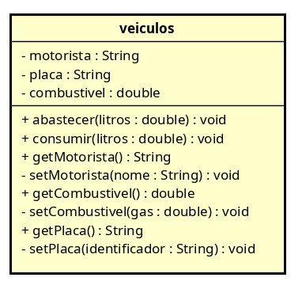

# Projeto Concluído: Refatoração Clean Code & OO — FiapRide (Módulo de Frota)

**Disciplina:** Programação Orientada a Objetos
**Projeto:** FiapRide (Módulo de Frota)
**Valor:** 10 pontos
**Conteúdo:** Aulas 01–03 (Classes, Métodos, Clean Code e Encapsulamento)
**Status:** ✅ Concluído e entregue

---

## O Contexto (O Problema Real)

Você foi contratado como Desenvolvedor Júnior na equipe do FiapRide.
O gerente de projeto te chamou e disse:

> "Um estagiário antigo tentou criar o sistema de cadastro dos carros do aplicativo. O código dele até funciona e roda no console, mas está uma bagunça! Não tem segurança nenhuma, os nomes não fazem sentido e a arquitetura fere todas as boas práticas. Precisamos que você arrume isso antes que vá para produção."

### Sua Missão (✅ Concluída)

Analisar, corrigir e blindar o código legado aplicando os conceitos das Aulas 01, 02 e 03:
- Classes
- Métodos
- Clean Code
- Encapsulamento

---

## Diagrama de Classes Refatorado (Astah)



---

## Código Refatorado

### Arquivo 1: Classe Modelo — `src/br/com/fiapride/model/Veiculo.java`

```java
package br.com.fiapride.model;

public class Veiculo {
    private String motorista;
    private String placa;
    private double combustivel;

    public Veiculo(String motorista, String placa, double combustivel) {
        setMotorista(motorista);
        setPlaca(placa);
        setCombustivel(combustivel);
    }

    public void abastecer(int litros) {
        setCombustivel(litros);
    }

    public void consumir(double litros) {
        if (litros < 0.0) {
            System.out.println("Não é possível fazer consumo negativo do combustível!");
        } else if (litros > getCombustivel()) {
            System.out.println("Não é possível consumir mais do que há de combustível no tanque!");
        } else {
            combustivel -= litros;
        }
    }

    public String getMotorista() {
        return this.motorista;
    }

    private void setMotorista(String nome) {
        this.motorista = nome;
    }

    public double getCombustivel() {
        return this.combustivel;
    }

    private void setCombustivel(double litros) {
        if (litros < 0.0 && this.combustivel == 0) {
            System.out.println("Não é possível abastecer um carro com valores negativos!\nValor não alterado!");
        }
        else if (litros < 0.0) {
            System.out.println("Não é possível abastecer um carro com valores negativos!\nValor settado para 0!");
            this.combustivel = 0.0;
        } else {
            this.combustivel += litros;
        }
    }

    public String getPlaca() {
        return this.placa;
    }

    private void setPlaca(String identificador) {
        this.placa = identificador;
    }
}
```

### Arquivo 2: Classe Principal de Teste — `src/br/com/fiapride/main/SistemaPrincipal.java`

```java
package br.com.fiapride.main;

import br.com.fiapride.model.Veiculo;

public class SistemaPrincipal {
    public static void main(String[] args) {
        Veiculo veiculo1 = new Veiculo("Carlos", "ABC-1234", -10);

        System.out.println("\n-------------------TESTE 1 (Criacao)--------------------------");
        System.out.println("Motorista: " + veiculo1.getMotorista() + " - Placa: " + veiculo1.getPlaca() + " - Gasolina: " + veiculo1.getCombustivel());

        System.out.println("\n-------------------TESTE 2 (Abastecer)------------------------");
        veiculo1.abastecer(100);
        System.out.println("Motorista: " + veiculo1.getMotorista() + " - Placa: " + veiculo1.getPlaca() + " - Gasolina: " + veiculo1.getCombustivel());

        System.out.println("\n-------------------TESTE 3 (Gastar Acima do Limite)-----------");
        veiculo1.consumir(150.0);
        System.out.println("Motorista: " + veiculo1.getMotorista() + " - Placa: " + veiculo1.getPlaca() + " - Gasolina: " + veiculo1.getCombustivel());

        System.out.println("\n-------------------TESTE 4 (Abastecer valor negativo)------------------------");
        veiculo1.abastecer(-10);
        System.out.println("Motorista: " + veiculo1.getMotorista() + " - Placa: " + veiculo1.getPlaca() + " - Gasolina: " + veiculo1.getCombustivel());
    }
}
```

---

## Estrutura Final do Projeto

```text
prova-refatoracao-mark-leal/
├── diagrama-veiculo.png          ← Diagrama Astah exportado (será renomeado para diagrama-veiculo-refatorado.png)
├── src/
│   └── br/
│       └── com/
│           └── fiapride/
│               ├── model/
│               │   └── Veiculo.java
│               └── main/
│                   └── SistemaPrincipal.java
├── bin/                          ← Classes compiladas (ignorado no .gitignore)
├── .gitignore
├── Veiculo.asta                  ← Arquivo do Astah
└── README.md
```

---

## Entrega (✅ Concluída)

### Checklist final

- [x] Repositório está **PÚBLICO** (testado em janela anônima!)
- [x] Arquivo PNG do Astah está na raiz do repositório (`diagrama-veiculo.png`)
- [x] Código-fonte está em `src/br/com/fiapride/...`
- [x] Commits feitos com mensagem clara
- [x] Link do GitHub funciona ao clicar
- [x] Todos os arquivos necessários estão presentes

---

## Melhorias Aplicadas (Resumo)

| Problema Original | Solução Aplicada |
|-------------------|------------------|
| Atributos públicos (`individuo`, `pl`, `gas`) | Encapsulamento com `private` + getters/setters controlados |
| Nomes confusos (`veiculos`, `individuo`, `pl`, `gas`) | Nomes claros: `Veiculo`, `motorista`, `placa`, `combustivel` |
| Validação inexistente (gasolina negativa, consumo > tanque) | Validações em `setCombustivel()` e `consumir()` |
| Setters públicos permitindo alteração indevida | Setters `private` — apenas construtor e métodos de negócio alteram estado |
| Construtor inexistente | Construtor com validação via setters |
| Método `adicionar/gasta` sem semântica de domínio | `abastecer()` e `consumir()` com regras de negócio |

---
